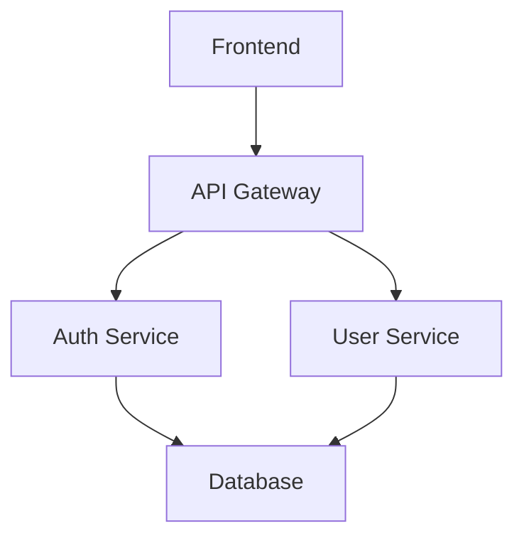

# 🧠 ORPT Repo Lens Viewer

A dynamic zoom-based viewer app that inspects any GitHub repository and renders a structured visual system using the ORPT doctrine (Operating, Repair, Parts, Training). The app follows zoom-level logic (30k → 20k → 10k → 5k) to navigate large or small repos visually and semantically.

## 🔭 ZOOM VIEW MODEL

### 🛰️ Zoom 30k – Repository Index (`/index-view`)
- **Purpose**: Global repository overview
- **Features**: 
  - Searchable list of all accessible GitHub repositories
  - Repository cards with metadata (stars, forks, language, last updated)
  - Direct links to repository overview pages
- **Navigation**: Entry point to the system

### 🛰️ Zoom 30k – Repository Overview (`/[repo]/overview-view`)
- **Purpose**: High-level repository documentation
- **Data Sources**:
  - `/VISUALS/index.yaml` → High-level list of modules
  - `/VISUALS/function_doc.md` → Plain English summary
- **Features**:
  - Module index with priority indicators
  - Function documentation display
  - Architecture overview
  - Quick action links to other views
- **Navigation**: Links to diagram view, module list, and troubleshooting

### 🛰️ Zoom 30k – Architecture Diagram (`/[repo]/diagram-view`)
- **Purpose**: Visual system architecture with performance metrics
- **Data Sources**:
  - `/VISUALS/overview.mmd` → Mermaid diagram
  - `/VISUALS/troubleshooting/issue_log.yaml` → Issue data for color coding
- **Features**:
  - Enhanced Mermaid diagrams with color-coded nodes
  - Performance metrics and health scoring
  - Issue summary with escalation warnings
  - Interactive node tooltips
- **Color Coding**:
  - 🟩 Green: No issues (0 fixes)
  - 🟨 Yellow: Warning (1 fix)
  - 🟧 Orange: Critical (2 fixes)
  - 🟥 Red: Escalated (3+ fixes)

### ✈️ Zoom 20k – Module List (`/[repo]/module-list-view`)
- **Purpose**: Detailed module breakdown and analysis
- **Features**:
  - Comprehensive module statistics
  - Health scoring and escalation tracking
  - Module type categorization (modules, components, files)
  - Performance metrics per module
  - Quick access to module details
- **Navigation**: Links to individual module detail views

### 🛩️ Zoom 10k – Module Detail (`/[repo]/module-detail-view/[moduleId]`)
- **Purpose**: Individual module analysis and troubleshooting
- **Data Sources**:
  - Module-specific issues from `/VISUALS/troubleshooting/issue_log.yaml`
  - Fix history from `/VISUALS/training/fixes.yaml`
  - Function documentation from `/VISUALS/function_doc.md`
- **Features**:
  - Detailed module description and status
  - Issue log with timestamps and fix counts
  - Fixes log with success/failure tracking
  - Escalation warnings for modules with 3+ fixes
  - Inline commenting system
  - "Escalated to Human" badges

### 🚁 Zoom 20k – Troubleshooting (`/[repo]/troubleshooting-view`)
- **Purpose**: System-wide issue tracking and escalation management
- **Features**:
  - Escalated modules summary
  - All issues overview with filtering
  - Recent fixes timeline
  - Performance statistics
  - Quick access to problematic modules

## 📁 VISUALS Folder Structure

Every repository should include a `/VISUALS` folder with the following structure:

```
/VISUALS/
├── index.yaml              # Module index and metadata
├── function_doc.md         # Plain English documentation
├── overview.mmd           # Mermaid architecture diagram
├── troubleshooting/
│   └── issue_log.yaml     # Issue tracking and escalation data
└── training/
    └── fixes.yaml         # Fix history and training data
```

### File Formats

#### `index.yaml` - Module Index
```yaml
- name: "auth-service"
  type: "module"
  description: "User authentication and authorization service"
  priority: "high"
  path: "src/services/auth.ts"

- name: "user-component"
  type: "component"
  description: "Reusable user profile component"
  priority: "medium"
  path: "src/components/User.tsx"
```

#### `function_doc.md` - Documentation
```markdown
# Repository Overview

This repository implements a modern web application with...

## Architecture

The system follows a microservices architecture with...

## Key Components

- Authentication Service
- User Management
- API Gateway

## Dependencies

- React 18
- Node.js 16
- PostgreSQL
```

#### `overview.mmd` - Mermaid Diagram


#### `troubleshooting/issue_log.yaml` - Issue Tracking
```yaml
- moduleName: "auth-service"
  totalFixes: 2
  lastUpdated: "2024-01-15T10:30:00Z"
  issues:
    - id: "AUTH-001"
      type: "error"
      message: "Token validation failing intermittently"
      status: "resolved"
      timestamp: "2024-01-10T14:20:00Z"
      fixCount: 2
```

#### `training/fixes.yaml` - Fix History
```yaml
- moduleId: "auth-service"
  fixes:
    - id: "FIX-001"
      issueId: "AUTH-001"
      description: "Added retry logic for token validation"
      appliedBy: "ai-assistant"
      timestamp: "2024-01-12T09:15:00Z"
      success: true
      notes: "Implemented exponential backoff"
```

## 🚀 Quick Start

### Prerequisites
- Node.js 18+ 
- GitHub Personal Access Token

### Installation

1. **Clone the repository**
   ```bash
   git clone https://github.com/djb258/repo-lens.git
   cd repo-lens
   ```

2. **Install dependencies**
   ```bash
   npm install
   ```

3. **Configure GitHub Token**
   
   **Option A: Environment File**
   ```bash
   # Create .env.local file
   echo "GITHUB_TOKEN=your_github_token_here" > .env.local
   ```
   
   **Option B: PowerShell Setup**
   ```powershell
   .\setup-github-token.ps1
   ```
   
   **Option C: Bash Setup**
   ```bash
   ./setup-github-token.sh
   ```

4. **Run the development server**
   ```bash
   npm run dev
   ```

5. **Open your browser**
   Navigate to `http://localhost:3000`

## 🎯 Usage

### Navigation Flow

1. **Start at Index View** (`/index-view`)
   - Browse all accessible repositories
   - Use search to find specific repos
   - Click any repository to zoom in

2. **Repository Overview** (`/[repo]/overview-view`)
   - View high-level documentation
   - See module index and architecture
   - Access quick actions

3. **Architecture Diagram** (`/[repo]/diagram-view`)
   - Visual system representation
   - Color-coded performance metrics
   - Interactive node exploration

4. **Module Analysis** (`/[repo]/module-list-view`)
   - Detailed module breakdown
   - Health scoring and statistics
   - Escalation tracking

5. **Deep Dive** (`/[repo]/module-detail-view/[moduleId]`)
   - Individual module analysis
   - Issue and fix history
   - Escalation warnings

6. **Troubleshooting** (`/[repo]/troubleshooting-view`)
   - System-wide issue tracking
   - Escalated modules overview
   - Performance monitoring

### Interactive Features

- **Search**: Real-time repository filtering
- **Breadcrumbs**: Clear navigation path
- **Altitude Markers**: Zoom level indicators
- **Fix This Buttons**: Pre-filled Cursor commands
- **Inline Comments**: Add notes to any section
- **Escalation Warnings**: Automatic issue detection

## 🎨 Color Coding System

### Performance Indicators
- 🟩 **Green**: Healthy (0 issues)
- 🟨 **Yellow**: Warning (1 fix)
- 🟧 **Orange**: Critical (2 fixes)
- 🟥 **Red**: Escalated (3+ fixes)

### Status Badges
- **Private**: Repository visibility
- **Escalated**: Human review required
- **Priority**: High/Medium/Low indicators

## 🔧 Development

### Project Structure
```
app/
├── index-view/                    # Zoom 30k - Repository index
├── [repo]/
│   ├── overview-view/             # Zoom 30k - Repository overview
│   ├── diagram-view/              # Zoom 30k - Architecture diagram
│   ├── module-list-view/          # Zoom 20k - Module list
│   ├── module-detail-view/        # Zoom 10k - Module detail
│   └── troubleshooting-view/      # Zoom 20k - Troubleshooting
├── api/
│   └── github-webhook/            # GitHub webhook handler
components/                        # Reusable UI components
lib/                              # Utility functions
examples/                         # Example VISUALS files
```

### Key Components
- `AltitudeMarker`: Zoom level indicators
- `BreadcrumbNav`: Navigation breadcrumbs
- `FixThisButton`: Cursor command integration
- `InlineComment`: Comment system
- `MermaidDiagram`: Enhanced diagram rendering
- `RepoCard`: Repository display cards

### Environment Variables
```env
GITHUB_TOKEN=your_github_personal_access_token
GITHUB_WEBHOOK_SECRET=your_webhook_secret_optional
```

## 🚀 Deployment

### Vercel Deployment
1. Connect your GitHub repository to Vercel
2. Set environment variables in Vercel dashboard
3. Deploy automatically on push to main branch

### Environment Setup
- `GITHUB_TOKEN`: Required for GitHub API access
- `GITHUB_WEBHOOK_SECRET`: Optional for webhook validation

## 🔮 Future Enhancements

### Phase 2 Features
- **Zoom 5k**: Function-level analysis
- **Real-time Updates**: Live issue tracking
- **Advanced Search**: Cross-repository analysis
- **Performance Metrics**: Historical trend analysis
- **Team Collaboration**: Shared comments and notes

### Advanced Features
- **AI Integration**: Automated issue detection
- **Custom Dashboards**: Personalized views
- **Export Capabilities**: PDF/PNG generation
- **API Access**: RESTful endpoints
- **Mobile Support**: Responsive design

## 📄 License

MIT License - see LICENSE file for details

## 🤝 Contributing

1. Fork the repository
2. Create a feature branch
3. Make your changes
4. Add tests if applicable
5. Submit a pull request

## 📞 Support

For issues and questions:
- Create an issue on GitHub
- Check the documentation
- Review example files in `/examples`

---

**🧠 ORPT Repo Lens Viewer** - Navigate your repositories with precision and insight. 