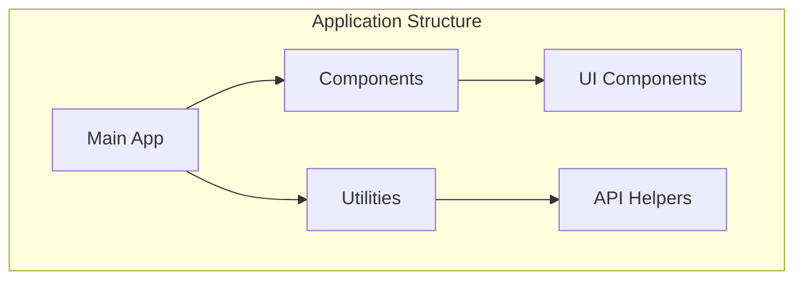
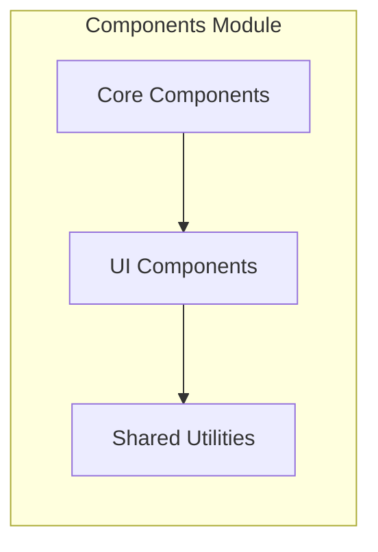

# Repo Lens

An interactive manual system for GitHub repositories that provides visual and narrative exploration at multiple altitude levels. Repo Lens transforms every repository into a comprehensive service manual with plain-English explanations and visual diagrams.

## 🎯 Altitude Model

Repo Lens follows a multi-level altitude system for repository exploration:

- **🌍 40,000 ft**: Global repository index with cards linking to repo pages
- **✈️ 30,000 ft**: Repository overview with plain-English index, wiki, and Mermaid diagrams
- **🏢 20,000 ft**: Module view showing module summary, diagram, and exported functions
- **🏠 10,000 ft**: Function view with function explanation, code blocks, and control flow
- **🔍 1,000-5,000 ft**: Detailed logic trees (future enhancement)

## 🚀 Features

### Core Functionality
- **Repository Overview**: View all your GitHub repositories in a clean, card-based interface
- **File Structure Explorer**: Navigate through repository files with plain-English summaries
- **Markdown Support**: Display and render markdown files with syntax highlighting
- **Mermaid Diagrams**: Visualize repository structure with Mermaid.js diagrams
- **Dark Mode**: Full dark mode support for better viewing experience
- **GitHub Integration**: Seamless integration with GitHub API for real-time data

### Interactive Manual System
- **✅ Altitude Markers**: Visual indicators showing current exploration level
- **✅ Breadcrumb Navigation**: Consistent navigation across all levels
- **✅ Inline Editable Comments**: Add notes and documentation on any page
- **✅ "Fix This" Buttons**: Generate Cursor commands for common issues
- **✅ Outdated Documentation Warnings**: Alert when code is newer than docs
- **✅ Visual Diagrams**: Mermaid diagrams for every level of documentation

## 📄 Pages & Altitude Levels

1. **Homepage (`/`) - 40,000 ft**: Lists all accessible GitHub repositories
2. **Repository Overview (`/[repo]`) - 30,000 ft**: Shows repository overview, wiki, and architecture diagrams
3. **Module View (`/[repo]/[module]`) - 20,000 ft**: Displays module structure, functions, and module-specific diagrams
4. **Function View (`/[repo]/[module]/[function]`) - 10,000 ft**: Shows function details, code, and function-specific documentation

## Tech Stack

- **Framework**: Next.js 14 (App Router)
- **Language**: TypeScript
- **Styling**: Tailwind CSS
- **GitHub API**: Octokit REST API
- **Diagrams**: Mermaid.js
- **Markdown**: React Markdown with syntax highlighting

## Getting Started

### Prerequisites

- Node.js 18+ 
- GitHub Personal Access Token

### Quick Setup

**Option 1: Automated Setup (Recommended)**

**Windows:**
```powershell
.\scripts\setup-github.ps1
```

**macOS/Linux:**
```bash
chmod +x scripts/setup-github.sh
./scripts/setup-github.sh
```

**Option 2: Manual Installation**

1. Clone the repository:
```bash
git clone https://github.com/djb258/repo-lens.git
cd repo-lens
```

2. Install dependencies:
```bash
npm install
```

3. Create environment file:
```bash
cp env.example .env.local
```

4. Add your GitHub token to `.env.local`:
```env
GITHUB_TOKEN=your_github_token_here
```

### Creating a GitHub Token

1. Go to [GitHub Settings > Tokens](https://github.com/settings/tokens)
2. Click "Generate new token (classic)"
3. Select scopes:
   - `repo` (Full control of private repositories)
   - `read:user` (Read access to user profile)
4. Copy the token and add it to your `.env.local` file

### Detailed Setup Guide

For comprehensive setup instructions, troubleshooting, and security best practices, see [docs/GITHUB_SETUP.md](docs/GITHUB_SETUP.md).

### Development

```bash
npm run dev
```

Open [http://localhost:3000](http://localhost:3000) to view the application.

### Building for Production

```bash
npm run build
npm start
```

## 📚 Documentation Structure

To get the most out of Repo Lens, add these files to your repositories following the altitude model:

### 30,000 ft Level
#### `REPO_WIKI.md`
Repository overview with altitude markers and plain-English explanations:

```markdown
# Repository Overview (30,000 ft)

## 🎯 Purpose
This repository contains a Next.js application for...

## 🏗️ Architecture Overview
The application follows a multi-level structure...

## 📁 Core Structure
- `app/` - Main application code
- `components/` - Reusable React components
- `lib/` - Utility functions and API helpers
```

#### `WIKI_MAP.mmd`
30,000 ft visual diagram showing repository architecture:



### 20,000 ft Level
#### `MODULE_MAP/[module].mmd`
Module-specific diagrams for each major component:



### 10,000 ft Level
#### `FUNCTION_SUMMARY/[function].md`
Function-level documentation with detailed explanations:

```markdown
# functionName (10,000 ft)

## 🎯 Purpose
This function handles...

## 📋 Parameters
- param1: Description
- param2: Description

## 🔄 Process Flow
1. Step one
2. Step two
3. Step three
```

## API Endpoints

### GitHub Webhook (Optional)

The application includes a webhook endpoint at `/api/github-webhook` that can receive GitHub push events and automatically update cached data when wiki files are modified.

To set up the webhook:

1. Add webhook secret to `.env.local`:
```env
GITHUB_WEBHOOK_SECRET=your_webhook_secret_here
```

2. Configure webhook in your GitHub repository:
   - URL: `https://your-domain.com/api/github-webhook`
   - Content type: `application/json`
   - Events: `Push events`

## Deployment

### Vercel (Recommended)

1. Push your code to GitHub
2. Connect your repository to Vercel
3. Add environment variables in Vercel dashboard
4. Deploy

### Other Platforms

The application can be deployed to any platform that supports Next.js:

- Netlify
- Railway
- DigitalOcean App Platform
- AWS Amplify

## Contributing

1. Fork the repository
2. Create a feature branch
3. Make your changes
4. Add tests if applicable
5. Submit a pull request

## License

MIT License - see LICENSE file for details

## Support

If you encounter any issues or have questions, please open an issue on GitHub. 