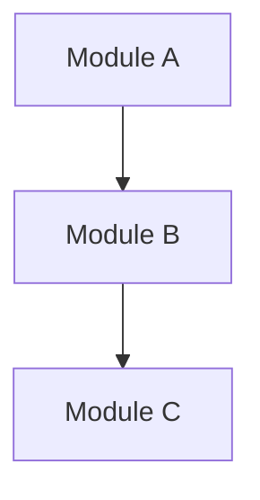

# 🧠 ORPT Repo Lens Viewer - Operational Repository Performance Tracker

A comprehensive 4-page Next.js application that transforms any GitHub repository into an interactive manual system with visual documentation, performance metrics, and troubleshooting data.

## 🎯 ORPT System Overview

The ORPT (Operational Repository Performance Tracker) system provides a structured approach to repository analysis with:

- **📊 Performance Metrics**: Health scores, fix counts, and escalation tracking
- **🎨 Visual Documentation**: Color-coded Mermaid diagrams with issue overlays
- **⚠️ Issue Tracking**: Automated detection and human escalation
- **📚 Training Memory**: Detailed fix logs and resolution history

## 🏗️ Architecture - 4-Page System

### 1️⃣ Page 1 - Repository Index (40,000 ft)
- **Route**: `/`
- **Purpose**: Global repository browser
- **Features**: 
  - Searchable repository list
  - GitHub API integration
  - Repository cards with metadata

### 2️⃣ Page 2 - Repository Overview (30,000 ft)
- **Route**: `/[repo]/overview`
- **Purpose**: Repository documentation and module index
- **Features**:
  - Module index from `VISUALS/index.yaml`
  - Function documentation from `VISUALS/function_doc.md`
  - Architecture overview and key components
  - Quick actions to diagram and troubleshooting

### 3️⃣ Page 3 - Architecture Diagram (30,000 ft)
- **Route**: `/[repo]/diagram`
- **Purpose**: Visual performance schematic
- **Features**:
  - Enhanced Mermaid diagram from `VISUALS/overview.mmd`
  - Color-coded nodes based on issue data
  - Performance metrics and health scores
  - Issue summary with escalation warnings

### 4️⃣ Page 4 - Module Detail (20k → 10k ft)
- **Route**: `/[repo]/module/[moduleId]`
- **Purpose**: Detailed module analysis
- **Features**:
  - Module-specific issue logs
  - Fix history from training data
  - Escalation warnings for problematic modules
  - Raw code access (optional)

## 📁 Required File Structure

Every repository must contain a `/VISUALS` folder with:

```
VISUALS/
├── index.yaml              # Module index (Page 2)
├── function_doc.md         # Repository summary (Page 2)
├── overview.mmd            # Mermaid diagram (Page 3)
├── troubleshooting/
│   └── issue_log.yaml      # Issue tracking (Page 3 & 4)
└── training/
    └── fixes.yaml          # Fix history (Page 4)
```

### File Formats

#### `index.yaml` - Module Index
```yaml
modules:
  - name: "components"
    path: "components/"
    description: "Reusable React components"
    type: "module"
    priority: "high"
```

#### `function_doc.md` - Function Documentation
```markdown
# Repository Overview

## Overview
Human-readable repository summary

## Architecture
System architecture description

## Key Components
- Component 1
- Component 2

## Dependencies
- Dependency 1
- Dependency 2

## Deployment
Deployment instructions

## Troubleshooting
Common issues and solutions
```

#### `overview.mmd` - Mermaid Diagram


#### `issue_log.yaml` - Issue Tracking
```yaml
issues:
  - moduleId: "components"
    moduleName: "components"
    issues:
      - id: "COMP-001"
        type: "error"
        message: "Memory leak detected"
        timestamp: "2024-01-15T10:30:00Z"
        fixCount: 2
        status: "resolved"
    totalFixes: 2
    lastUpdated: "2024-01-15T10:30:00Z"
```

#### `fixes.yaml` - Training Memory
```yaml
fixes:
  - moduleId: "components"
    fixes:
      - id: "FIX-001"
        issueId: "COMP-001"
        description: "Fixed memory leak"
        timestamp: "2024-01-15T11:00:00Z"
        appliedBy: "system"
        success: true
        notes: "Used proper cleanup function"
```

## 🎨 Color Coding System

### Node Status Colors
- **🟩 Green (0 fixes)**: Healthy - No issues
- **🟨 Yellow (1 fix)**: Warning - Minor issues
- **🟧 Orange (2 fixes)**: Critical - Multiple issues
- **🟥 Red (3+ fixes)**: Escalated - Human review required

### Escalation Threshold
- **3+ fixes** = Automatic escalation to human review
- **Visual warnings** displayed on affected modules
- **"Escalated to Human"** badges shown

## 🚀 Technology Stack

- **Next.js 14** with App Router
- **GitHub REST API** via Octokit
- **Mermaid.js** for enhanced diagrams
- **YAML parsing** with js-yaml
- **Tailwind CSS** for responsive design
- **TypeScript** for type safety
- **Vercel** for deployment

## 🔧 Setup Instructions

1. **Clone the repository**:
   ```bash
   git clone https://github.com/djb258/repo-lens.git
   cd repo-lens
   ```

2. **Install dependencies**:
   ```bash
   npm install
   ```

3. **Configure GitHub token**:
   ```bash
   cp env.example .env.local
   # Edit .env.local and add your GitHub token
   ```

4. **Run the development server**:
   ```bash
   npm run dev
   ```

5. **Deploy to Vercel**:
   ```bash
   npm run build
   # Deploy to Vercel with environment variables
   ```

## 📊 Performance Features

### Health Scoring
- **0-100% health score** based on module status
- **Real-time metrics** from issue tracking
- **Visual progress bars** and status indicators

### Issue Tracking
- **Automated detection** of common problems
- **Fix counting** per module
- **Escalation system** for complex issues

### Training Memory
- **Detailed fix logs** with success/failure tracking
- **Resolution notes** and implementation details
- **Historical data** for pattern recognition

## 🔮 Future Enhancements

### Phase 2 Features (Scaffolded)
- **Firebase integration** for real-time fix logs
- **Visual alerts** and escalation dashboard
- **Live error pinging** (Cursor/Mantis integration)
- **AI-powered fix suggestions** at code level

### Advanced Features
- **Multi-repository comparison**
- **Trend analysis** and performance forecasting
- **Team collaboration** features
- **Custom escalation rules**

## 📝 Example Usage

1. **Browse repositories** at the global index
2. **Select a repository** to view its ORPT documentation
3. **Explore modules** through the interactive index
4. **View performance** via color-coded diagrams
5. **Drill into details** for specific modules
6. **Monitor escalations** for human intervention

## 🤝 Contributing

The ORPT system is designed to be extensible. Key areas for contribution:

- **Enhanced Mermaid parsing** for more complex diagrams
- **Additional issue detection** patterns
- **Custom escalation rules** and thresholds
- **Integration plugins** for other development tools

## 📄 License

MIT License - see LICENSE file for details. 