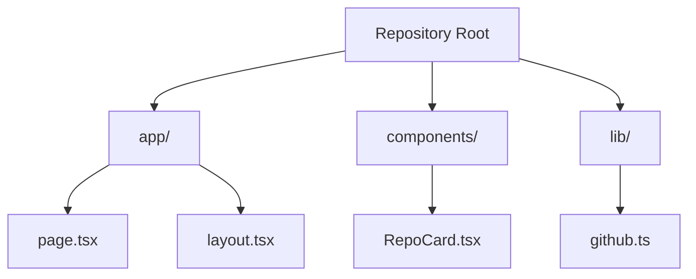

# Repo Lens Altitude Model Guide

Repo Lens uses an altitude-based navigation system to help you explore repositories from high-level structure down to individual logic lines. Think of it like flying at different altitudes to understand a landscape.

## 🧭 Altitude Levels

### 🌐 40,000 ft: Global Repo Index (`/`)
**Purpose**: Overview of all your repositories
- Lists all accessible GitHub repositories
- Shows repository stats (stars, forks, language)
- Click any repo to descend to 30,000 ft

### ✈️ 30,000 ft: App Overview (`/[repo]`)
**Purpose**: High-level application structure
- Displays major modules and components
- Shows repository-wide documentation
- Renders full application Mermaid diagram
- Click modules to descend to 20,000 ft

### 🧭 20,000 ft: Module View (`/[repo]/[module]`)
**Purpose**: Module-level understanding
- Shows module-specific documentation
- Lists exported functions and components
- Renders module-specific diagrams
- Click functions to descend to 10,000 ft

### 🔬 10,000 ft: Function View (`/[repo]/[module]/[function]`)
**Purpose**: Function-level analysis
- Displays function explanations and code
- Shows control flow diagrams
- Lists function signatures and parameters
- Ready for 1,000-5,000 ft drill-down

### 🔍 1,000-5,000 ft: Logic Trees (Future)
**Purpose**: Detailed logic analysis
- Inline conditionals and error handling
- API call sequences
- Data flow analysis
- Performance insights

## 📁 File Structure for Documentation

To get the most out of Repo Lens, organize your documentation using these file patterns:

### Repository Level (30,000 ft)
```
REPO_WIKI.md          # Plain-English repository overview
WIKI_MAP.mmd          # Full application structure diagram
```

### Module Level (20,000 ft)
```
[module]/REPO_WIKI.md     # Module-specific documentation
[module]/WIKI_MAP.mmd     # Module structure diagram
[module]/[module].mmd     # Alternative module diagram
```

### Function Level (10,000 ft)
```
[module]/FUNCTION_SUMMARY/[function].md    # Function explanation
[module]/FUNCTION_SUMMARY/[function].mmd   # Function flow diagram
```

## 🎯 Navigation Flow

```
40,000 ft: / → Click repo
    ↓
30,000 ft: /[repo] → Click module
    ↓
20,000 ft: /[repo]/[module] → Click function
    ↓
10,000 ft: /[repo]/[module]/[function]
```

## 📝 Documentation Examples

### REPO_WIKI.md Example
```markdown
# Repository Overview

This is a Next.js application that provides...

## Key Components

- `app/` - Next.js app router pages
- `components/` - Reusable React components
- `lib/` - Utility functions and API helpers

## Architecture

The application follows a clean architecture pattern...
```

### WIKI_MAP.mmd Example


### Function Summary Example
```markdown
# getRepositories Function

This function fetches all repositories accessible to the authenticated user.

## Purpose
- Retrieves repository list from GitHub API
- Handles authentication and error cases
- Returns formatted repository data

## Parameters
None

## Returns
Array of Repository objects with metadata

## Usage
Called on homepage to display repository grid
```

## 🚀 Best Practices

1. **Start High**: Always begin at 40,000 ft to understand the overall landscape
2. **Document Each Level**: Create appropriate documentation files for each altitude
3. **Use Consistent Naming**: Follow the file naming conventions for automatic detection
4. **Keep Diagrams Updated**: Maintain Mermaid diagrams as your code evolves
5. **Write Plain English**: Focus on narrative explanations, not technical jargon

## 🔧 Customization

You can customize the altitude model by:
- Adding new documentation file patterns
- Creating custom module detection rules
- Extending function parsing patterns
- Adding new visualization types

## 🎨 Visual Indicators

Each altitude level has distinct visual indicators:
- 🌐 Global: Repository cards and stats
- ✈️ App: Module overview and structure
- 🧭 Module: Function lists and diagrams
- 🔬 Function: Code analysis and flow
- 🔍 Logic: Detailed breakdowns (future)

This altitude model helps you understand any repository at the appropriate level of detail, from high-level architecture down to individual function logic. 